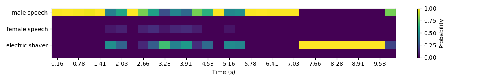

# MGA-CLAP-SED-downstream-inference-demo
This is an unofficial implementation of inference code for the downstream SED task.

This is an extended version of `example.py` from the official repository [https://github.com/Ming-er/MGA-CLAP], taking into account the temperature parameter used during training and adding visualization function. Using `example.wav` from the official repository, you can obtain the following images.

